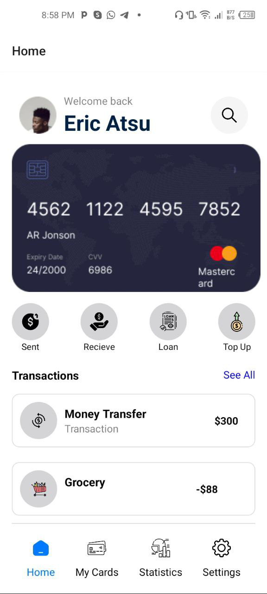
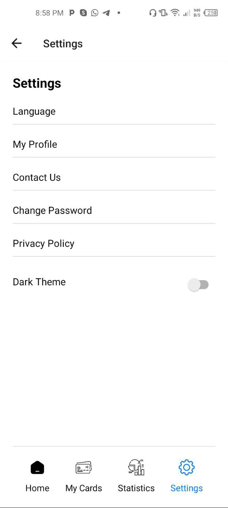
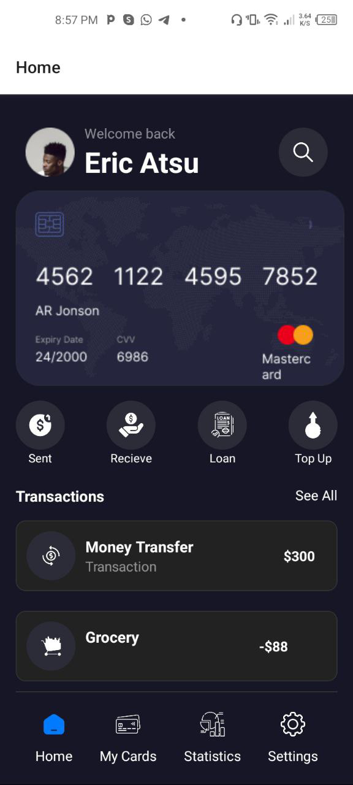
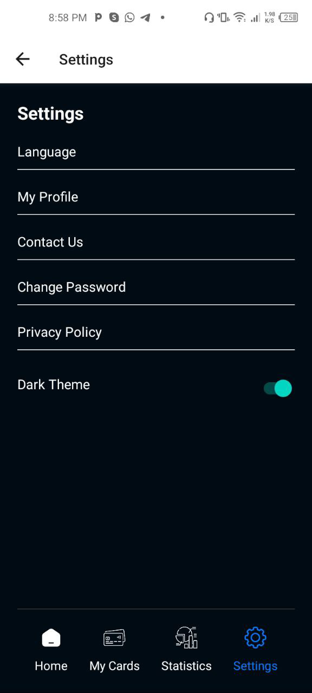

# React Native Project

## Table of Contents

- [Project Overview](#project-overview)

    This project is a React Native application with functionalities such as dark theme toggle, multi-language support, and navigation between different screens like Home and Settings. It uses `react-navigation` for navigation and `expo` for development.
- [Features](#features)

  - HomeScreen, 
  - Settings
  - Toggle to light and dark mode

## Project Overview

This React Native project provides a user-friendly interface with a dark theme option, language selection, and various screens for managing settings, viewing transactions, and more. It is designed to be easily extendable and maintainable.

## Features

- **Dark Theme Toggle:** Switch between light and dark themes.
- **Language Selection:** Choose from multiple languages.
- **Navigation:** Navigate between Home, Settings, and other screens.
- **Transactions Display:** View a list of recent transactions with details.

## Screenshots

### Light Mode

### Dark Mode

